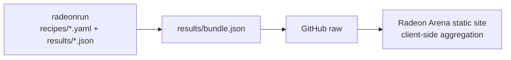

# Radeon Arena

A static **LLM performance leaderboard for AMD Radeon GPUs**.

Radeon Arena is now a pure display site: it does not run benchmarks, accept web-form submissions, host an admin console, or maintain a database. The benchmark source of truth lives in [`radeon-arena/radeonrun`](https://github.com/radeon-arena/radeonrun), where recipes and measured result JSON files are versioned in git.

## Current Architecture



- Data source: `https://raw.githubusercontent.com/radeon-arena/radeonrun/main/results/bundle.json`
- Hosting: static Next export served by nginx (`docker compose`, port `13000 -> 80` on cicd)
- No runtime API routes, no Postgres, no auth tokens, no admin UI
- Submit flow: users open a pull request in `radeon-arena/radeonrun` with a recipe and measured result file

## Stack

| Layer | Choice |
|---|---|
| Framework | Next.js 14 App Router, `output: "export"` |
| Styling | Tailwind CSS |
| Data | GitHub raw `radeonrun/results/bundle.json` |
| Hosting | nginx static container |

## Development

```bash
pnpm install
pnpm dev
# open http://localhost:3000
```

Build the static export:

```bash
pnpm build
# output is written to ./out
```

## Deployment

```bash
cd /home/lkang/codes/radeon-arena
SSHC='ssh -F /home/lkang/.ssh/config -i /home/lkang/.ssh/id_rsa -o IdentitiesOnly=yes -o BatchMode=yes'
rsync -az --delete --exclude node_modules --exclude .next --exclude out --exclude .git --exclude .pnpm-store -e "$SSHC" ./ cicd:~/radeon-arena/
$SSHC cicd 'cd ~/radeon-arena && sudo docker compose up -d --build --remove-orphans'
```

Verify on cicd:

```bash
curl -s -o /dev/null -w '%{http_code}\n' http://localhost:13000/strix/leaderboard
```

## Project Layout

```text
src/
  app/
    page.tsx                  # homepage
    [hw]/[[...rest]]/page.tsx  # /{hw}/{tab}
    blogs/page.tsx             # static blog shell
    leaderboard/page.tsx       # legacy redirect to /strix/leaderboard
  components/
    Header, Footer, Carousel, leaderboard views
  lib/
    githubData.ts              # fetches radeonrun bundle from GitHub raw
    benchmarkMapping.ts         # maps raw radeonrun rows -> Benchmark[]
    aggregate.ts                # snapshot/carousel aggregation
    scoring.ts                  # users/orgs leaderboard scoring
    types.ts                    # domain model
```

## Data Flow

1. A recipe is added to `radeonrun/recipes/*.yaml`.
2. The radeonrun `reproduce.yml` workflow runs it on a self-hosted Radeon runner.
3. The workflow commits `results/<device>/<recipe>.json` plus regenerated `results/index.json` and `results/bundle.json`.
4. The static site reads `bundle.json` directly from GitHub raw and aggregates the leaderboard in the browser.

## License

MIT
