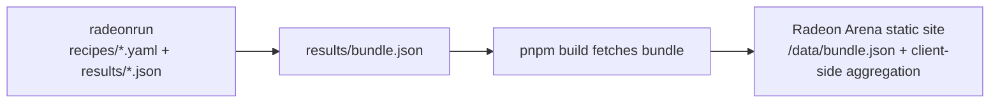

# Radeon Arena

A static **LLM performance leaderboard for AMD Radeon GPUs**.

Radeon Arena is now a pure display site: it does not run benchmarks, accept web-form submissions, host an admin console, or maintain a database. The benchmark source of truth lives in [`radeon-arena/radeonrun`](https://github.com/radeon-arena/radeonrun), where recipes and measured result JSON files are versioned in git.

## Current Architecture



- Data source: bundled static file `/data/bundle.json` (downloaded from `radeonrun/results/bundle.json` during `pnpm build`)
- Hosting: `https://radeon-arena.com/` via Cloudflare → `latex-tools` nginx static origin (`/var/www/radeon-arena/`)
- No runtime API routes, no Postgres, no auth tokens, no admin UI
- Submit flow: users open a pull request in `radeon-arena/radeonrun` with a recipe and measured result file
- Public policy pages: `/terms`, `/privacy`, and `/data-policy`

## Stack

| Layer | Choice |
|---|---|
| Framework | Next.js 14 App Router, `output: "export"` |
| Styling | Tailwind CSS |
| Data | GitHub raw `radeonrun/results/bundle.json` |
| Hosting | nginx static container |

## Development

```bash
pnpm install
pnpm dev
# open http://localhost:3000
```

Build the static export:

```bash
pnpm build
# output is written to ./out
```

## Deployment

Production deploy is a static export synced to the US `latex-tools` server:

```bash
pnpm build
rsync -az --delete out/ latex-tools:/tmp/radeon-arena-out/
ssh latex-tools 'sudo rsync -a --delete /tmp/radeon-arena-out/ /var/www/radeon-arena/'
```

Production URL:

```text
https://radeon-arena.com/
```

The nginx vhost is on `latex-tools` at `/etc/nginx/sites-available/radeon-arena.com`, with access logs in `/var/log/nginx/radeon-arena.com.access.log`. The legacy cicd Docker deployment on `10.161.176.38:13000` is not the production path.

## Project Layout

```text
src/
  app/
    page.tsx                  # homepage
    [hw]/[[...rest]]/page.tsx  # /{hw}/{tab}
    blogs/page.tsx             # static blog shell
    terms/page.tsx             # terms of use
    privacy/page.tsx           # privacy notice
    data-policy/page.tsx        # benchmark data policy
    leaderboard/page.tsx       # legacy redirect to /strix/leaderboard
  components/
    Header, Footer, Carousel, leaderboard views
  lib/
    githubData.ts              # reads /data/bundle.json in the browser
    benchmarkMapping.ts         # maps raw radeonrun rows -> Benchmark[]
    aggregate.ts                # snapshot/carousel aggregation
    scoring.ts                  # users/orgs leaderboard scoring
    types.ts                    # domain model
```

## Data Flow

1. A recipe is added to `radeonrun/recipes/*.yaml`.
2. The radeonrun `reproduce.yml` workflow runs it on a self-hosted Radeon runner.
3. The workflow commits `results/<device>/<recipe>.json` plus regenerated `results/index.json` and `results/bundle.json`.
4. The radeon-arena build downloads that bundle into `public/data/bundle.json`.
5. The static site reads `/data/bundle.json` and aggregates the leaderboard in the browser.

## License

MIT
