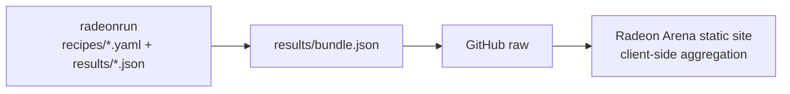

# Radeon Arena

A static **LLM performance leaderboard for AMD Radeon GPUs**.

Radeon Arena is now a pure display site: it does not run benchmarks, accept web-form submissions, host an admin console, or maintain a database. The benchmark source of truth lives in [`radeon-arena/radeonrun`](https://github.com/radeon-arena/radeonrun), where recipes and measured result JSON files are versioned in git.

## Current Architecture



- Data source: bundled static file `/data/bundle.json` (downloaded from `radeonrun/results/bundle.json` during `pnpm build`)
- Hosting: GitHub Pages at `https://radeon-arena.github.io/radeon-arena/` (custom domain `https://radeon-arena.com/` pending DNS)
- No runtime API routes, no Postgres, no auth tokens, no admin UI
- Submit flow: users open a pull request in `radeon-arena/radeonrun` with a recipe and measured result file

## Stack

| Layer | Choice |
|---|---|
| Framework | Next.js 14 App Router, `output: "export"` |
| Styling | Tailwind CSS |
| Data | GitHub raw `radeonrun/results/bundle.json` |
| Hosting | nginx static container |

## Development

```bash
pnpm install
pnpm dev
# open http://localhost:3000
```

Build the static export:

```bash
pnpm build
# output is written to ./out
```

## Deployment

GitHub Pages deploys automatically on every push to `main` using `.github/workflows/pages.yml`.

Production URL:

```text
https://radeon-arena.github.io/radeon-arena/
```

Local cicd hosting on `10.161.176.38:13000` has been stopped; use GitHub Pages as the canonical deployment. Custom domain `radeon-arena.com` is configured only after Cloudflare DNS points to GitHub Pages.

## Project Layout

```text
src/
  app/
    page.tsx                  # homepage
    [hw]/[[...rest]]/page.tsx  # /{hw}/{tab}
    blogs/page.tsx             # static blog shell
    leaderboard/page.tsx       # legacy redirect to /strix/leaderboard
  components/
    Header, Footer, Carousel, leaderboard views
  lib/
    githubData.ts              # fetches radeonrun bundle from GitHub raw
    benchmarkMapping.ts         # maps raw radeonrun rows -> Benchmark[]
    aggregate.ts                # snapshot/carousel aggregation
    scoring.ts                  # users/orgs leaderboard scoring
    types.ts                    # domain model
```

## Data Flow

1. A recipe is added to `radeonrun/recipes/*.yaml`.
2. The radeonrun `reproduce.yml` workflow runs it on a self-hosted Radeon runner.
3. The workflow commits `results/<device>/<recipe>.json` plus regenerated `results/index.json` and `results/bundle.json`.
4. The radeon-arena Pages workflow downloads that bundle into `public/data/bundle.json` during build.
5. The static site reads `/data/bundle.json` and aggregates the leaderboard in the browser.

## License

MIT
